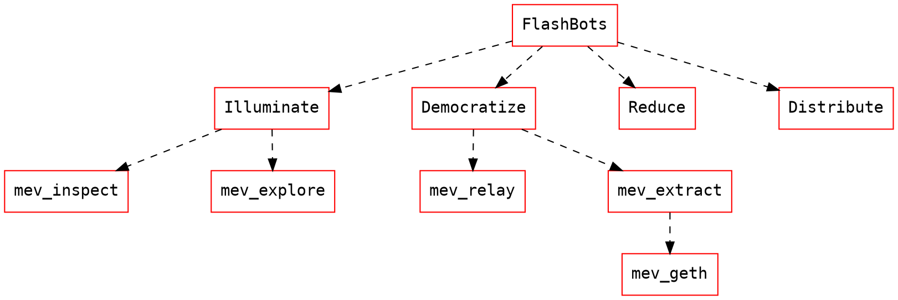

# Flashbots Engineering Roadmap

| Phase  | Deadline   | Navigator  | Description                             |
| ------ | ---------- | ---------- | :-------------------------------------- |
| P1-POC | 30/10/2020 | @thegostep | Minimal proof of concept and benchmarks |
| P2-MVP | 30/01/2021 | @thegostep | Pool integrations                       |

## Phase 1 - POC

### Deliverable

- Order templates
- Benchmarks
- Geth Fork
- ETHResearch post

### Core Devs

- @thegostep
- @jparyani
- @epheph
- @vaibhavchellani
- @samczsun

### Communication

- twice-weekly core dev call

### mev-geth todo

- rpc gateway
- rpc documentation
- integration tests (local)
- profile performance

### mev-inspect todo

- review data labels / presentation
- host public dashboard
- add profitability metrics
- add inspectors
- inspector contribution guide

### Spec

#### Order templates

- What are the 80/20 most profitable strategies?
- How to modify transaction object to express these strategies?
- How are payments settled?

#### Benchmarks

- MEV backtester
  - metrics
    - opportunity size (user value taken)
    - current value sent to miners per opportunity
    - num failed transactions
    - amount of blockspace used by failed transactions
    - inflated gas price?
  - modular plugins for new strategies
    - what strategies should be built next?
  - output accounts and nonces involved in PGA
- research relevance
  - dashboard
  - breadth first search for quantifying coverage (how much of the strategy space are we catching, how to distribute per protocol/strategy/bot)
- What is the MEV strategy taxonomy and how to express strategies in order types?
- What is miner upside from running flashbots?
- What is expected network relief? (assuming all front-running activity moved to flashbots)
- What is backtest of benchmarks over last 6 months?
- What is live performance over one week? (assuming 100% flashbot penetration)

#### Geth Fork Spec

- Key considerations
  - make minimal changes to geth in order to make setup and auditing easy
  - avoid impact existing operations (latency, validity, security)
  - have flashbot system failure revert to regular geth operation
  - consider spamming of invalid bundles
  - provide similar infrastructure transparency guarantees as regular mempool
  - provide strategy privacy until inclusion
- Components
  - [Bundle interface](https://github.com/MEV-Ship/flashbots/issues/3)
  - [Networking](https://github.com/MEV-Ship/flashbots/issues/4)
  - [Bundle validation](https://github.com/MEV-Ship/flashbots/issues/5)
  - [Block template generation](https://github.com/MEV-Ship/flashbots/issues/6)
  - [Profit switching algo](https://github.com/MEV-Ship/flashbots/issues/7)
  - [Integration tests](https://github.com/MEV-Ship/flashbots/issues/7)
- TODO
  - how do we notify the network that a block contains a flashbots bundle?
    - require trader to emit event and validate by miner
    - miner adds data to block header
  - should we send receipts to the traders about their position in the auction?
  - how should block template profitability be communicated to profit switching algo?
  - how to setup environment for integration tests

#### ETHResearch post

- Introduction to FlashBots
- Expected positive externalities
- MEV Taxonomy
- Benchmarks
- Setup instructions
- Further Discussion

## Phase 2 - MVP

### Deliverable

- 2+ pool integrations
- economics proposal
- implementation of key research topics
- roadmap for future integrations
- roadmap for future improvements

#### mev-relay

- build and host an optional gateway for propagating bundles to miners

#### mev-geth

- deploy to production, build hashrate
- improve searcher interface
- improve reporting

#### mev-inspect

- build library for efficient identification of mev opportunities

#### mev-explore

- build dashboard for making sense of mev extraction activity in the wild

### Core Devs

- @thegostep

### Communication

- twice-weekly core dev call

### Timeline

| Week  | Task - @thegostep | Task - @ | Task - @ | Task - @ |
| ----- | :---------------- | :------- | :------- | :------- |
| Nov-1 | Kickoff           |          |          |          |
| Nov-3 |                   |          |          |          |
| Dec-1 |                   |          |          |          |
| Dec-3 |                   |          |          |          |
| Jan-1 |                   |          |          |          |
| Jan-3 |                   |          |          |          |

### Spec
